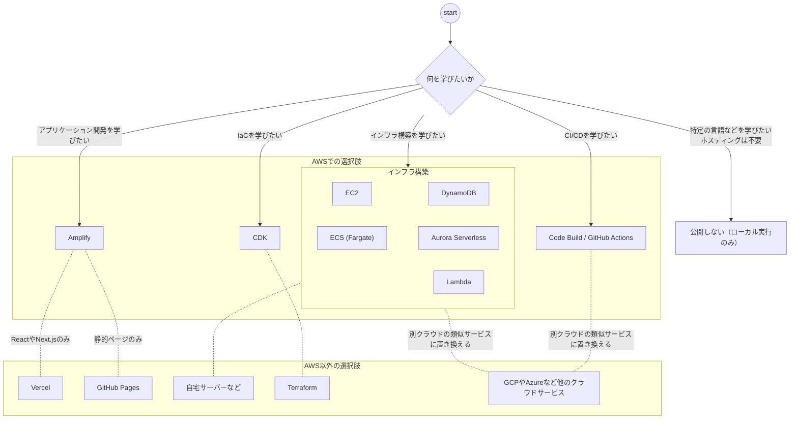

# 概要

---

個人開発のホスティング先を選ぶとき、「何を学びたいのか？」を基準に考えてみてはいかがでしょうか。

---

ホスティング先の選定基準として、「コスト」「手軽さ」「スケーラビリティ」で比較する記事は多いです。しかし、個人開発者にとって重要な判断軸の一つは **「何を学びたいのか」** ではないでしょうか。

この記事では、「何を学びたいか」を起点にホスティング先を選ぶ考え方を、以下の2点で解説します：

- **「何を学びたいか」を元に、ホスティング先を選びましょう。**
- **「何を学びたいか」は小さく絞って最短で目標達成できるようにしましょう。**

また、最後に筆者の経験談も紹介します。

なお、本記事は筆者が AWS ユーザーであるため、AWSのサービスを中心に記載します。GCP や Azure などを学びたい場合は、それぞれのクラウドサービスに置き換えて考えてください。

# 対象読者

- 個人開発を通して学びたい人
- 個人開発でホスティング先の選定に迷っている人

# 説明しないこと

- 個人開発で稼ぎたい人向けの説明
- AWSを含めた各種サービスの解説
- コストに関する比較

# 「何を学びたいか」で選択肢を絞る

個人開発でホスティング先を選ぶとき、まず自分に問うべきは「このプロジェクトで何を学びたいのか」です。

以下の図は、「何を学びたいか」を起点にした選択肢の整理です。何を学びたいかを基準に、対応するAWSでの選択肢と、AWS以外の選択肢を、代表的なものに絞って記載しています。

なお、無理にサーバーを立てて公開しなくても良い場合もあると思いますので、「公開しない」選択肢も含めています。こちらも自身の「何を学びたいか」を基準に選択すればよいでしょう。

## 補足

- 図中、AWSの選択肢からAWS以外の選択肢への点線は、「同じ目的で使えるAWS以外の代替サービス」を示しています。
- 静的ページのみの場合はS3も選択肢に挙がりますが、Amplifyが推奨されているため、S3は除外しています。詳細は[Amazon S3 を使用して静的ウェブサイトをホスティングする](https://docs.aws.amazon.com/ja_jp/AmazonS3/latest/userguide/WebsiteHosting.html)の注記を参照してください。
- 各選択肢は代表例として捉えてください。あくまで「何を学びたいか」でサービスを選択すべきです。

# 「何を学びたいか」は小さく絞れ

上図を踏まえてホスティング先を選ぶ際に重要なポイントは、「何を学びたいか」を小さく絞ることです。

以下の順番で説明していきます。

- 絞らないとどうなるか？
- どう絞るのか？
- 絞り方の具体例

## 絞らないとどうなるか？

例えば、以下の例は典型的な失敗パターンです。

---

「インフラを勉強したいからフルスクラッチでアプリケーションを作ろう」

---

この場合、インフラを一から構築することになります。クラウドとはいえ、例えばEC2もAuroraもLambdaも構築しようとすると（特に未経験のサービスを複数扱うと）、学習コストが高く時間もかかります。それに加えてアプリケーション（設計やコーディング）もやるとなると、相当な労力と時間がかかります。

結果、どれも中途半端になったり、途中で挫折したり、失敗に陥りやすいです。

後述の、筆者の失敗談もこのパターンです。

## どう絞るのか？

絞り方はシンプルに、「自分の知識・経験に対して、背伸びしすぎていないか」を考えると良いと思います。背伸びしすぎかどうかは、人それぞれ違いますが、以下のような観点を考えてみるとよいでしょう：

|観点|内容|理由|
|--|--|--|
|どのくらいの期間で完成できるか|1か月や半年など、自分なりに続けられる期間を目安にすると良いでしょう ※ただし厳密な見積は不要です|完成する（≒学び終わる）までに時間がかかりすぎると、個人開発としてモチベーション維持などが難しいためです。|
|知らないサービスや技術はいくつあるか|知らないサービス: EC2, RDB, ELBなど 知らない技術: プログラミング言語,ドメイン,証明書など。|完成までの期間とも関わりますが、知らないサービスや技術が多いと、意外なところで"ハマりがち"です。 半年のつもりが1年経っても完成しない…と言うのは避けたいです。|

## 絞り方の具体例

「アプリケーション開発もインフラ構築も学びたい場合」を例にします。この場合、まずは、どちらが大切かを決めましょう。

例えば、アプリケーション開発を重視するなら、アプリケーション部分に時間をかけるべきです。Amplifyを利用して、インフラ管理を最小限にしましょう。

逆に、インフラ構築を重視するなら、そちらに時間をかけるべきです。ただし、いきなりフル構成（ALB+EC2+DB & API）は大変です。さらに絞るべきです。まずは、EC2（もしくはECS）で簡単なサンプルコードを動かしてみましょう。うまくいったら、次のステップに進むと良いでしょう。

※前提知識次第なので、AWSの各サービスを十分理解しているなら、いきなりフル構成でも良いと思います。

# 筆者の経験談

ホスティング先の選定に関して、2つの経験談を紹介します：

- EC2フルスクラッチで陥った「学びすぎ」の罠
- Amplifyでプロダクト開発

## EC2フルスクラッチで陥った「学びすぎ」の罠

過去に、EC2 をベースにインフラをフルスクラッチで構築しようとしたことがあります。さらに、CDKによるIaCも一緒にやろうとしていました。当時は、EC2もCDKもほぼ経験がなかったため、かなりの背伸びでした。

実際、CDKのデプロイエラーの解消、VPCやEC2やLambdaなどの設定、コーディングなど、やらなければいけないことは多くありました。

結局、そのプロジェクトは途中で断念しました（細々と続けたものの、形にならないまま、途中で飽きて辞めてしまいました）。

典型的な、学びたいこと多すぎ（絞れていない）失敗パターンだと思います。

## Amplifyでプロダクト開発

筆者は「君はねこを飼えるか？」というWebアプリ（ねこ学習アプリ）を個人開発しています。今回は、Amplify を選びました。

EC2フルスクラッチの失敗を踏まえて、今回は学びたいことを絞りました。

- 学びたいこと：プロダクト開発（企画部分）
- 学びの対象外としたこと：設計やコーディング、インフラ構築、その他の収益化やマーケティング的な部分

あくまで目的をプロダクト開発として、それ以外は学びたいことから外しました。実は、最初は設計も学びたいと思っていたのですが、期間がかかりすぎていたため、途中で学びたいことから外しました。

上記を踏まえて、設計とコーディングは生成AIになるべくお任せ、インフラはAmplify（バックエンド構築は生成AI）にお任せしました。収益化やマーケティング的な部分も一切手を出していません。あくまで、プロダクトとして何を作るか（≒企画）の部分に時間をかけました。

（生成AIが設計もコーディングもできた点が大きいですが）学びたいことを絞ったおかげで、半年程度でサービスとして公開できるようになりました。と言っても、執筆時点（2026/02/01時点）ではプレビュー版としての公開です。プロダクト開発においても、細かい機能はスコープ外とし、まず公開することを優先しました。

参考として、実際に公開しているWebアプリのリンクを記載します。
https://can-you-really-own-a-cat.neko-engineer.com/

# まとめ

ホスティング先の選定記事は「機能比較表」が多いですが、個人開発においては **「自分は何を学びたいのか」** を最初に言語化することが最も重要だと考えています。

ホスティング先を選ぶときは、以下を良く考えるとよいと思います。

1. **このプロジェクトで何を学びたいのか？** — プロダクトなのか、インフラなのか、特定の技術なのか
2. **学びたくないことに時間を使っていないか？** — 「ついでに学べる」は個人開発では罠になる
3. **その選択肢は、学びたいことに最短で到達できるか？** — 目的に対してオーバースペックなら、マネージドサービスに寄せる

ぜひ、みなさんも何を学びたいかをベースに個人開発を実践してみてください！

# 参考文献

## AWSサービス

- [Amazon S3 を使用して静的ウェブサイトをホスティングする](https://docs.aws.amazon.com/ja_jp/AmazonS3/latest/userguide/WebsiteHosting.html)
- [個人開発はAmplifyでホスティングしよう](https://speakerdeck.com/tttol/ge-ren-kai-fa-haamplifytehosuteinkusiyou)

## 他観点でのサービス比較（ブログ等）

- [もう迷わない！個人開発のデプロイ先、無料サービス徹底比較【2025年版】](https://note.com/ojizou003/n/n74fd76c70ab5)
- [Next.js デプロイ先比較ガイド (Vercel/Cloudflare/Netlify/AWS Amplify/自前サーバー)](https://zenn.dev/takna/articles/compare-nextjs-deployment-service)
- [静的webホスティング比較](https://qiita.com/guemon/items/84d5d71c9cc21d9596dc)