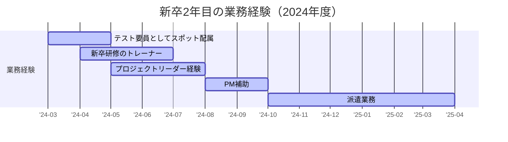

## はじめに
この記事は、ITエンジニアとして新卒2年目を終えた私の業務経験をまとめたものです。また、業務の中で気を付けたことや得た学びも書きました。

同じ新卒ITエンジニアの方の参考になれば幸いです。

## 前提
最初に、簡単に私のプロフィールを記載します：
- 中規模SIerに所属
- クラウド上でソフトウェアを開発
- 2023年4月入社の新卒で、現在3年目

## 対象読者
- ITエンジニア、新卒1~2年目
- 他の人の経験を参考にしたい方
- 今の自分の状況と比較したい方

この記事を通じて、私の経験談から学びを得たり、自分自身の成長のヒントにしていただければ幸いです。

## 関連記事
以下の記事で新卒1年目のことをまとめています：
https://zenn.dev/neko_student/articles/1fc9c40284c3ac

## 新卒2年目のスキルやレベル
最初に、新卒2年目のスキルやレベルをまとめます。個人の志向や前提スキル、会社の業務や文化などに強く依存しますので、あくまで一つの例として参考にしてください。

まずは、いくつか主要な点を以下に挙げていきます。総じて、"社会人として一人前"、もしくはその一歩手前くらいが目安かな考えています[^1]。

- 後輩への指導や相談役を任せられる
- 与えられたタスクを自己管理しながら進められる
- わからないことがあっても、チームメンバーに相談しながら、解決することができる
- チームの役割や業務内容に一定の理解がある
- 特定領域や機能に対する深い理解がある
- 小規模チームのリーダーを担う

※最後の「小規模チームのリーダーを担う」については、特に、個人の志向や会社の方針が大きくかかわる部分かと思います。

補足ですが、スペシャリスト志向の人の場合は、大きな成果が出にくい（知識や経験を積む必要があり、ある意味下積み期間が長い）と思っています。なので、焦らず、しっかり知識や経験を積んで行くことが大切だと思います。

## 新卒2年目の業務経験
業務で経験したことの概要をまとめます。

### 業務経験の全体像

この後、それぞれの詳細（業務経験と得た学び）を書いていきますが、まずは一覧化します：

- テスト要員としてスポット配属
  - 単純作業にせず自分なりに考えて動くこと
  - 炎上案件の現場を体感し、反面教師として学ぶ
- 新卒研修のトレーナー
  - 業務量の調整と効率化の重要性
  - スケジュール管理の基本とリカバリーの大切さ
  - 目的意識の重要性
- プロジェクトリーダー経験
  - 要件定義・設計の段取りと具体化の重要性
  - リスク分析とお客様への説明の徹底
- PM補助
  - ドキュメントで認識を合わせる大切さ
  - マルチベンダ環境でのコミュニケーションの重要性
- 派遣業務
  - 信頼構築には基本の徹底が不可欠
  - 自社以外の文化・技術力の違いを経験し、視野を広げる

### テスト要員としてスポット配属（3~4月）
新卒1年目の最後(3月)から短期で参画した案件です。当時は、テストフェーズで人手不足（≒炎上案件）でした。私を含め、十数人くらいがテスト要員として新規参画していく状況でした。

ここでの経験をまとめると、以下の2つのトピックになるかと思います：
- 単調な作業の中でモチベーション維持の難しさ
- 炎上案件の現場を体感

一つずつ書いていきます。

#### 単調な作業の中でモチベーション維持の難しさ
一言で言うとつまらなかったです笑

なぜなら、人手不足・テストフェーズで新規参加という状況もあり、単純なテスト作業しか任されなかったからです。もう少し詳しいタスク内容を書くと、以下のイメージです：

- 既にあるテスト仕様書に従って、よくわからないシステムのよくわからないテストを実施する。

（人に依ると思いますが、私にとっては）単純なつまらない作業です。そのような状況でもモチベーションを保つため、**単純作業にせず自分なりに考えて動くこと**を意識していました。例えば、以下のようなことを意識していました：
- テスト対象の設計書やコードを見てみる。
  - テスト対象を理解する必要がありますが、なるべく設計書やコードを熟読しました。
  - テストを単なる作業で終わらせず、他人の成果物を見ることで少なからず学びを得ることができました。
- テスト仕様書に書いていないこともテストする。
  - 単にテスト仕様書の通りに実行するのではなく、自分なりに考えてテストすべきところをテストしました。
  - テストのスキルも身に付きやすく、不具合を見つけたときも（少し）うれしい気持ちになります。

結果、チームメンバーからの評価も多少得られたと思います（"テスト要員としてきた新人にしては使えるな"くらいのイメージかと思います…）

#### 炎上案件の現場を体感
こちらは辛いことではなく、"炎上案件ってこんな感じなんだ"を知れて良かったという話です。補足しておくと、既存メンバーはとても忙しそうなのですが、新規参画したメンバーは（大した仕事を振られないので）辛さや忙しさは少なかったです。

ここでは、**炎上案件の現場を体感し、反面教師として学び**があったと思います。やや抽象的ですが、主要な所をまとめると以下の通りです：
- わかりにくいテスト仕様書
  - 仕様書を見ただけでは操作方法や確認観点がわからない
  - テストコードで実施している粒度と変わらないテスト
- 形骸化するテスト
  - テスト仕様書がわかりにくいこともあり、テスト品質は作業者次第という状況
  - それでも忙しすぎて、テスト消化が優先される
  - 結果、品質にリスク大
- ピリピリした雰囲気
  - 例えば、テスト仕様書でわからないことを聞きに行くと、"教えてくれるけど、ちょっとイライラしている"みたいな状況

まとめると、短い期間でしたが得るものはあったなと感じています。

### 新卒研修のトレーナー（4~6月）
少し期間が被っていますが、同時期に新卒研修のトレーナーを経験しました。業務内容としては、研修で講義をする、研修の成果物（コード）をレビューをする、各種相談に乗るといったものです。

元々（私が新卒研修を受けていた時から）トレーナーをやりたいと思っていたのもあり、この期間はかなり充実して楽しかったです。ただし、うまくいったことばかりではなく、学びも多かったです。主なトピックを挙げると、以下の点です：

- 業務の忙しさを実感
- スケジュール管理の甘さ
- 改善活動は目的が大事

こちらも順に説明していきます。

#### 業務の忙しさを実感
この時期は、トレーナー業務と案件業務の掛け持ちで、それなりに忙しかったです。工数としては半分ずつ（1日4時間ずつ）なのですが、案件が少し忙しくなると残業必須…みたいな状況があるあるでした（私はまだ良い方で、他のトレーナーはもっと忙しそうでした）。

ここで一番大事だなと思ったのは、**業務量を調整すること**です。効率よく業務をこなすことも大切ですが、それでは限界があります。早い段階でマネージャーや上司に相談すること、掛け持ち前提でタスクを減らす/他の人に助けてもらうことが、大切です。もちろん、業務が調整できない場合は頑張るしかないですが、それでも早めに、忙しくなる前から相談することで、軽減できることもあるかもしれません。

#### スケジュール管理の甘さ
ここでは、スケジュールに対する認識の甘さを痛感しました。

当時、新卒研修のトレーナー開始時点での認識は、以下のようなものでした：

新卒研修は基本的に去年（=私が新卒研修を受けた時）と同じで、特に懸念はない。むしろ、"時間をかけてじっくり深く教えてあげよう"くらいに考えていました。

ただ、それは全く間違いでした。特に研修内容が変わっていた（追加研修があった）のです。正確に言うと、追加研修の存在は認識していたはずなのに、去年と同じスケジュールで大丈夫と甘く考えていたことが、一番の問題でした。

ここでの学びは、**スケジュール管理の基本とリカバリーの大切さ**です。主要な点は、以下の2点です：
- タスクを洗い出して、スケジュールを最初に引く
  - 基本中の基本ですが、一番最初にスケジュールを引くべきです。タスクの全体像を理解しているつもりでも、頭の中で完結させずに、文字や図にすることで気づくことがあるかもしれません。
  - 今回の例は特にそうで、スケジュールを引けば、余裕があるのかないのか、進捗が良いのか悪いのかを検知することができたと思います。
- スケジュールが遅れたら、周りを巻き込みながらいち早くリカバリー案を考える
  - 仮にスケジュールを引いていても、遅れてしまう場合はあります。その場合はリカバリーが大切です。
  - 今回の例では、効率化、研修を減らしたり簡単にする、といった案をトレーナー全員で相談しながら進めました。また、新卒研修特有ですが、新卒（研修を受ける側）も巻き込めたのは良かったことでした。当事者意識を持って、自己管理をしてもらったり、どうすれば良いかを一緒に考えることができ、新卒の方にとっての経験にもなったと思います。

#### 改善活動は目的が大事
最後ですが、改善活動も（勝手に）実施していました。ただ、どれも効果があまりなかったなと感じています。

改善活動ですが、片手間でできるちょっとしたことが中心でした（やりたくて勝手にやっていた感じなので、あまり時間を取ってできなかった）。例えば、レビュー観点を整理したり、GitHub Actionsで一部レビューの自動化ができないか検討したり、、などです。

結果、どれも使ってもらえなかったり、導入できずに中途半端で終わったりでした。

ここでの学びは、**目的意識の大切さ**です。一言で言うと費用対効果を考えるという、基本的なことです。改善活動の効果が薄かったのは、"あったら便利だろうな"くらいの甘い考えで実施していたからだと思います。それではダメで、"これがあれば誰がどのくらいうれしいか？"を具体的に考え、時間をかけてでも効果があると判断できる場合のみ実施するべきです。

**補足）レビュー観点の話**

目的意識は特に大切だと思うので、補足として一つだけ例を書きます：

当時、レビュー観点の整理に取り組みました。当時は"レビュー観点を統一したほうが、トレーナー毎にレビューのバラつきがなくて良い"という程度の認識でした。ただし、結果は、作成したレビュー観点はあまり使われませんでした。これは最初の目的意識が甘かったことが原因です。改めて考えると、以下の通りで、時間をかけて導入しなくても良かったのかなと感じています：

- トレーナーたちは自分なりのレビュー観点でレビューしており、多少のバラつきはあっても、質が低いという課題があるわけではない。
- また、忙しくて、レビュー観点の資料を読み込む時間がない。
- よって、導入するほどのメリットはない。

後日談ですが、次年度のトレーナーが、私が作ったレビュー観点を使ってくれたそうです。なので、意味がなかったわけではなく、初めから"来年のトレーナーのための資料"という目的で作ればよかったと感じています。

### 案件でのプロジェクトリーダー経験（5~7月）
こちらは新卒研修のトレーナーと同時期（最初の炎上案件と入れ替わり）での経験です。新卒1年目に配属された案件の継続（追加開発）で、ある程度経験を積めたことから、プロジェクトリーダーを任せてもらえました。規模としては、他に開発メンバー2人の小規模案件です。

ここでのトピックは以下の2点です：

- 要件定義・設計ドキュメント作成など幅広く経験
- プチ炎上を経験し、調整力の必要性を痛感

こちらも詳しく説明していきます。

#### 要件定義・設計ドキュメント作成など幅広く経験
リーダーとして、要件定義や設計をしたのは良い経験だったと思います。

挙げるときりがないのですが、一番は（少しトレーナーの話と被りますが）**要件定義のスケジュール**です。

案件でスケジュールを引いていたのですが、例えば、要件定義xx月01日～xx月10日、設計xx月11日～xx月20日…のようなざっくりとしたものでした。それでは全くダメで、特に要件定義（お客様との調整が必要なもの）では、「○○日の会議でxxを決める」くらいに具体化するべきだったと思います。さらに、「決まった結果、成果物を作って次の会議で検討する」というところまで決められるとよかったなと感じています（もちろん、事前にわからないことは多いですが、わからないことを明確にしておくという点も大事だと思います）。

結局、要件定義はバタバタで、次で説明するプチ炎上にもつながってしまいます。

#### プチ炎上を経験し、調整力の必要性を痛感
要件の認識齟齬が、実装期間中に発覚しました。急遽、要件定義を見直し、設計実装をやり直すことになりました。当然、時間が無くなり、残業でなんとか巻き返すことができました（残業で済んだのは良かった方だと思っています）。

ここで学んだのは、**リスク分析とお客様への説明の徹底**です。以下、詳しく説明します：
- リスク分析の重要性：
  - リスクを把握し対策を行うことがとても重要です。
  - 例えば、「要件定義の認識齟齬が発生するかもしれない」というのはリスクです。特に認識齟齬が発生しそうな箇所があるなら、重点的に認識合わせをしたり、議事録や設計書を残したりといった対策が考えられます。これらのリスクをできる限り洗い出し、事前に把握・対策することが大切です。
- お客様への説明を徹底：
  - 洗い出したリスクは、積極的にお客様に説明するとよいです。
  - 2つの意味があり、安心感を与えることと、当事者意識を持ってチームとして対策できることです。
    - 1つ目については、事前にリスクを聞いていたほうが安心できると思います（特に、いきなりスケジュールが遅れる報告をされるより、事前にリスクを聞いた方が安心できますよね）。
    - 2つ目は、スケジュールが遅れても、事前に（一緒に）対策を考えていたので、遅れを非難するよりも、これからどうするかをチームとして一緒に考えやすいです。

### PM補助（8~9月）
一つ前の案件が終わり、スポットで案件参画をしました。この案件では、PMの方が忙しすぎるので、その補佐として私がアサインされました。主に、資料作成や細かいタスクの巻取りをしていました。

ここでの学びは、以下の2点です：

- 要件定義書、シーケンス図を学ぶ
- マルチベンダ環境の難しさを学ぶ

#### 要件定義書、シーケンス図を学ぶ
この案件では、（これまで経験した案件と比べて）しっかりしたドキュメントを作成していました。特に、要件定義書（数ページのword資料）とシーケンス図（plantuml）を活用し、お客様や関係者との認識齟齬を最小限にしていました。

（やや抽象的ですが）改めて**ドキュメントで認識を合わせる大切さ**を学びました。

#### マルチベンダ環境の難しさを学ぶ
この案件では、マルチベンダ環境（システムAはシステム開発会社a、システムBはシステム開発会社bという環境）でした。先ほどリスクの話をしましたが、このプロジェクトでの最大のリスクは「ベンダー間の認識齟齬」だったと思います。

というのも、ベンダー間のコミュニケーションが薄く、定例会議はなく、チャットでのやりとりも反応が薄いような状況でした。結果、結合テスト付近で、スケジュールがバタバタしたり、責任があいまいになりかけたり（バグや遅れはどっちのせい？など）といった問題が発生しました。

ここでの学びは、**マルチベンダ特有のリスクがあること**です。上述の通り、コミュニケーションでの認識齟齬、スケジュールの遅れ、責任範囲の曖昧化などがありました。コミュニケーションを密に取ることが特に大事で、定例会議の設定は必須だと感じています。

ちなみに、この案件では、リスクや課題をお客様に積極的に共有したり、ベンダー間でのデイリーミーティングを設定したりといった対策を取り、なんとか丸く収まりました。

### 派遣業務（10月~現在）
業務経験の最後で、現在も続いている派遣業務です。SESのような感じで、他社（SIer）に派遣され、そちらチームのメンバーとして開発に取り組んでいます。

案件の内容はもちろん、様々な新しいことを経験しました。周りのレベル、案件の進め方、文化や雰囲気の違いなど、自社だけでは感じなかったものがいくつもありました。

ここでのトピックは以下の2点です：
- 信頼構築の難しさを実感
- 自社以外の文化を経験

#### 信頼構築の難しさを実感
自社と派遣先での一番の違いは、信頼がないことです。当然と言えばそうですが、派遣先から見ると、"実績やスキルがわからない新人が派遣されてきた"という状況なので、信頼はほとんどありませんでした。

そこでの学びは、**信頼獲得には、結局基本の徹底が大切であること**です。

例えば、以下のようなことを心掛けました。どれも基本ですが、効果があったと思います：
- 与えられたタスクを素早く正確にこなす
- 困ったことはすぐに質問・相談する
- 報告はできるだけ丁寧にする

**補足）**
特に、2つ目の「困ったことはすぐに質問・相談する」が一番取り組みやすいと思います。最初は、"どんなに小さいことでも聞く"とよいです。質問をするのとしないのとでは、周りからの印象は以下のようになると思います：
- 質問をしない場合："困っているのに黙っているのかもしれない。不安だな…"
- （小さいことでも）質問をする場合："困っているなら質問をしてきてくれるだろう。そこまで心配しないで大丈夫そうだな"

最後の「報告はできるだけ丁寧にする」ですが、気を付けるべきは相手によって報告の粒度がかわることです。以下は、かなりざっくりですが例です：
- （自社の）信頼がある相手向けには、"いつも通りタスクをやっていて困りごとはないです"と報告する
- （派遣先の）信頼がない相手向けには、"タスク1,2,3..を実施中です。タスク1はxxで実装量が多いですが、期限はooなので遅れはないです"と報告する

一番最初にこの違いを意識せずに、派遣先の相手に自社の粒度の報告をしていましました。不安な顔で、"もう少し詳しく教えてください"と言われたのは強く印象に残っています。

#### 自社以外の文化を経験
信頼のなさの他にも、周りのレベルの違い、雰囲気や文化の違いを感じました。ちなみに、どちらの会社が良い/悪いという話ではなく、両方に良さがありました。

ここでの学びは、**自社以外の文化の違い**です。いくつかありますが、例として"技術力の高さ"にも色々あるという点を説明します：

- 自社では、最新技術のキャッチアップの早さという点で技術力が高い
- 派遣先は、要件定義の正確さや開発プロセスの点で技術力が高い

自社は（漠然と）技術力が高いと思っていたのですが、それだけではないんだなと、自分の認識の甘さに気が付きました。

新人のうちに2社での開発を経験できたのは、良い経験だったと思います。

## まとめ・3年目に向けて
2年目は業務で幅広く挑戦できた一年でした。特に、失敗や新しい環境での経験が自分の成長につながったと感じています。3年目は、これまでの学びを活かし、さらにアウトプットを増やし、周囲に良い影響を与えられるエンジニアを目指します。

この記事が、同じような立場の方の参考や励みになれば幸いです。

[^1]: マインドや意識という意味で"社会人として一人前"と書いています。"ITエンジニアとして一人前"になるには、幅広い知識や業務理解が必要で、もう少し時間がかかるイメージです。
