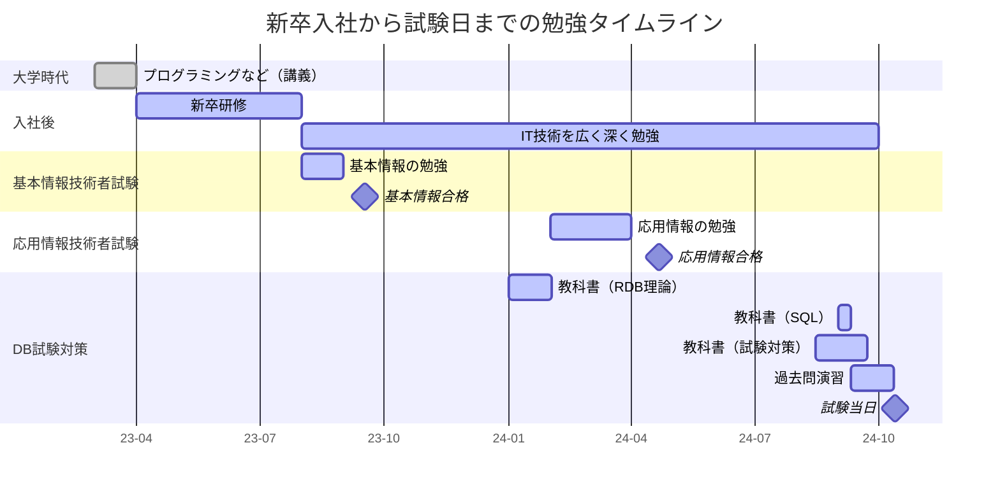

# 概要
令和6年度データベーススペシャリストに合格したので、その記録です。
筆者は未経験の新卒2年目ですので、新人目線の内容を多めに書いています！

主に勉強方法と受験の感想について、以下の流れで書いていきます。
- 試験の全体像と難易度の感想
- 新卒2年目で合格するためのスケジュール
- 合格に向けた勉強方法
- その他、合格に向けて工夫したこと

# 対象読者
- 新人でデータベーススペシャリスト受験を考えている人
- これからデータベーススペシャリストの試験を予定している人
- 他人の勉強方法を参考にしたい人

# 筆者の前提知識
新卒2年目で、データベースの実務経験はほぼゼロです。
※新卒研修でRDBを学び、ツールとして（たまに）SQLを使う程度

未経験（院卒の数学専攻）でITを勉強し始めて、令和5年秋期に応用情報技術者試験を取得しています。
未経験とはいえ、大学時代にプログラミングの講義を受けていたのと、クラス図などのUML図は勉強していました。

また、キャリア像はスペシャリスト志向を考えています
（なので、データベース"スペシャリスト"の合格に向けて、かなり頑張りました笑）
# 試験の全体像と難易度の感想
正確な情報は、[IPAの公式サイト](https://www.ipa.go.jp/shiken/kubun/db.html)や他のブログを見てください。
ここでは、難易度について個人的感想の観点で書いておきます。

まとめると、
- 「高度試験」というだけあってかなり難しい
- ただし、しっかり勉強すれば、実務経験なし & 新人エンジニアでも十分合格は狙える

です。

まず難しい。大まかに分けると以下のイメージです：
|区分|概要|感想|
|--|--|--|
|午前I|応用情報レベル（※筆者は午前I免除）| 筆者は受験していない。応用情報の範囲が広いため午前I免除は重要という感覚。|
|午前II|応用情報レベルに、DB特化問題が追加 | 午後対策をしていれば、午前IIの範囲はカバーできる。仕上げとして過去問道場をやれば十分突破可能。|
|午後I|記述式で、3問中2問を解答する。RDBの基礎理論を前提に、長文・記述式。|RDBの基礎理論の理解が必須。そのうえで、短い時間で問題を解けるように過去問対策をする必要がある。午後Iと言えど、難しいので油断できない。|
|午後II|記述式で、2問中1問を解答する。午後Iより長い長文・記述式。| 午後I同様、過去問対策が必要。午後Iより問題文が長く、かなり難しい。 |

以上の通り、特に午後の難易度が高いと感じました。
ちなみに、筆者は午後Iの点数が一番低かった（7割）ため、午後Iと午後IIはどちらも油断できないです。

ただし、知識中心の試験であるため、しっかり対策すれば合格は狙えると思いました。
大切なことは以下の2点だと思います：
- RDBの基礎理論を理解する。
- 過去問をたくさん解き、試験の形式（記述式+長文読解）に慣れる。

# 新卒2年目で合格するためのスケジュール
入社前から考えると、ざっくり以下のような流れでした。
※表中の教科書（○○）の部分は、次節の[合格に向けた勉強方法](#合格に向けた勉強方法)で書いたものです。

まず、新卒研修は、内1ヶ月程度がSQL+概念モデリング研修でした。

さらに、新卒研修後も、「IT技術を広く深く勉強」をするようにしています。
冒頭の通り、キャリアがスペシャリスト志向なので、（DBに限らず）勉強するようにしています。（個人的には結構頑張っています）

新卒1年目の記録は以下の記事にも書いていますので、興味あれば見てみてください：
https://zenn.dev/neko_student/articles/640029c5af6989

IPA試験については、基本情報を新卒1年目の9月に取得、応用情報を新卒2年目の4月に取得しています。
日常から「IT技術を広く深く勉強」して、基本情報・応用情報の範囲もカバーできるようにしていました。もちろん、試験直前の対策として教科書や過去問道場も実施しています。

最後にデータベーススペシャリスト試験の対策です。ここも「IT技術を広く深く勉強」の延長で勉強しつつ、直前1ヶ月は試験特化の勉強に集中していました。

データベーススペシャリスト試験の対策については、次節で詳細を説明します。

# 合格に向けた勉強方法
データベーススペシャリスト試験合格に向けた勉強方法について書いていきます。
ざっくりと、以下の2パートです：

- 事前対策（～1ヶ月前）：RDBについて広く・しっかり学ぶ期間
  - 教科書（RDB理論）：[リレーショナルデータベース入門](https://amzn.asia/d/1RbPrmS)
  - 教科書（SQL）：[達人に学ぶSQL徹底指南書 第2版 初級者で終わりたくないあなたへ](https://amzn.asia/d/3U7rBcC)
- 直前対策（1か月前～）：教科書や過去問など、試験のための対策
  - 教科書（試験対策）：[情報処理教科書 データベーススペシャリスト 2024年版](https://amzn.asia/d/2YooTfp)
  - 過去問（午後対策）：[過去問（公式サイト）](https://www.ipa.go.jp/shiken/mondai-kaiotu/index.html)
  - 過去問（午前対策）：[過去問道場](https://www.db-siken.com/dbkakomon.php)

## 事前対策（～1ヶ月前）
RDBの理論について、しっかり勉強しました。
特に試験対策は意識せず、時間をかけて少しずつ勉強していきました。

### 教科書（RDB理論）：リレーショナルデータベース入門
おすすめ度：★★☆☆☆
RDBに関する理論が網羅的に、深く書かれている本で、試験範囲的にもかなりカバーされています。

範囲的には、正規化・ログ法・トランザクション・ロック・分散DBなど、理論的な内容が書かれています。
ただし、内容が難しい（書き方の癖が強い）ので、読みにくいので、おすすめ度は低めです。
※RDBを理論的に（≒数学的に）理解したい人向け

なお、試験対策という意味では、後述の教科書（試験対策）「情報処理教科書 データベーススペシャリスト 2024年版」だけでも対応できるかもしれません。
### 教科書（SQL）：達人に学ぶSQL徹底指南書
おすすめ度：★★★★★
SQLについてしっかり学べる本です。
筆者はSQLの知識薄めでしたが、これ一冊でかなり詳しくなる（なった気になれる）のでおすすめです。

試験のSQL部分は十分対策になりました。
特に、window関数をカバーしているのでおすすめです（window関数は最近登場したらしく、試験での出題率も増えているらしい）

## 直前対策（1か月前～）
試験前1か月を試験対策に使いました。
平日は時間があれば（0時間~1時間）教科書読み・過去問道場を実施、土日は過去問を主にやっていました。

まずは一つ目の教科書（試験対策）「情報処理教科書 データベーススペシャリスト 2024年版」を読み、その後に過去問対策をしました。

なお、教科書（試験対策）の一冊メインで対策する場合はそれなりに読破に時間がかかると思います（1か月前から読み始めると間に合わないと思います。）
※筆者は、前述の教科書（RDB理論）「リレーショナルデータベース入門」を読み終えていたため、比較的すぐ読み終わりました。
### 教科書（試験対策）：情報処理教科書 データベーススペシャリスト 2024年版
おすすめ度：★★★★★
（たぶん）定番の教科書で、これ一冊で試験範囲をほぼカバーできます。

特に、午後対策として以下の部分が手厚いです：
- 概念モデリング・試験頻出の業務の解説
- 過去問が解説付きで付録（古いものはダウンロード）

SQLの解説が少なめなので、SQL未経験の場合は、先述の教科書（SQL）「達人に学ぶSQL徹底指南書」も読んでおくとよいと思います。

### 過去問（午後対策）
おすすめ度：★★★★★
公式サイトから入手するか、教科書（試験対策）「情報処理教科書 データベーススペシャリスト 2024年版」の付録から利用できます。

午後対策として過去問は必須で、できるだけ多い年度分を実施するとよいです。
筆者の場合は、4年分（令和5~2年）をやりました。ただ、本番の午後Iで不安感があったため、もう2年分くらいやってもよかったと思いました。なお、長文が苦手な人は、さらに数をこなす必要があると思います（当然ですが、やればやるほど良い）

また、過去問を解く際には、以下の点を工夫して解きました：
- 全ての問題を解く
- 時間を測って解く
- 過去問を解くスケジュールを考えておく

#### 全ての問題を解く
本番では大問を選択して回答しますが、基本的に全ての大問を解くようにしました。なぜなら、午前・午後の対策を考えると、全ての範囲を理解していた方が良いからです。

※本番で迷わないために、回答する大問はある程度絞っておくとよいです。
#### 時間を測って解く
試験時間が短いため、時間を測って問題を解くスピード感に慣れておく必要があります。

#### 過去問を解くスケジュールを考えておく
午後問題の全ての大問解く場合、一年分の過去問に最低一日はかかります。（※下にイメージを書きました）もちろん、集中力次第では、さらに日数がかかります。

そのため、多くの年度を解こうと思うと、早めに始めないといけません。

【過去問にかかる時間イメージ】
|区分|本番|大問全て回答する場合（単純計算）|
|--|--|--|
|午後I|1.5時間（3問中2問を選択）|2.25時間（3問中3問を選択）|
|午後II|2時間（2問中1問を選択）|4時間（2問中2問を選択）|

さらに、答え合わせ・解説を読んで理解する時間を加えると、8時間くらいはかかります。
土日だけやるのか、集中力がどれくらい持つかなどにも依りますが、上記を見越して計画を立てておく必要があります。
例）筆者の場合、土日だけ過去問演習・過去問4年分解いたので、2週間は最低必要となる。
　　実際には、平日も少し使ったうえで3週間かかっています笑
### 過去問道場（午前対策）
おすすめ度：★★★★★

午前II対策である過去問道場です。移動時間などの空き時間は、基本的にスマホで過去問道場をやるようにしていました。
午後対策として教科書や過去問（午後対策）をやりつつ、午前対策は過去問道場で十分対応できる印象です。

最低75%くらい取れるとよい（個人の感想）と思います。

ちなみに、解説は有料版でしか見れないので注意です（なので、1ヶ月だけ課金しました）

# これから受験する人へ（新卒目線、合格に向けて工夫したこと）
筆者の試験対策については、これまで記載した通りです。勉強方法は人それぞれですので、参考になる点があれば幸いです。
最後に、"勉強方法ではないけど工夫したこと"を書いて終わりにしようと思います
## 直前対策だけでなく、常に学習する
[新卒2年目で合格するためのスケジュール](#新卒2年目で合格するためのスケジュール)でも触れましたが、「IT技術を広く深く勉強」は大切だと思います。

また、日常でもDB対策になる場面は**作れる**と感じました。

**業務に概念モデリングを取り入れる**
概念モデリングは要件定義などの上流工程で扱うことが多く、（特に新卒だと）業務で概念モデリングを行う機会は少ないと思います。
ただし、"取り入れる"ことはできると思います。例えば、以下のような場面です：
- メンバーとの認識合わせ・コミュニケーション
  - 例）先輩に任されたタスクに対して、「これで理解あってますか？」とモデルを書いて見せてみる。
  - コーディング関連ならクラス図でも可だと思います。
- 業務で扱っているシステムに関する業務の理解
  - 例）要件定義でなくても、既存のモデルがあっても、自分で（勝手に）モデリングをしてみる。

**SQLのことを考えてみる**
業務で直接SQLを使っていない場合でも、DBは何かしらの形で係わっていると思います。なので、時々SQLについて考えてみると面白いです。
- システムの中にDBがあれば、それを考えてみる。
  - 例）どんなデータが入っているか？○○の情報を取り出すなら、どういうSQLが書けるか？
- SQL以外をSQLで置き換えるとどうなるか考えてみる。
  - 例）Javaでデータを処理する時に、SQLで書くならどうなりそうか？（SQLの方が楽かも？とか）

**日常でデータベースのことを考えてみる**
最近、色々とIT化が進んでいますが、その裏にはDBがあるはずです。たまに、そのことを考えてみると意外と面白いです。
- 例）飲食店のタッチパネルで注文できるシステム（概念モデリングはどうなるか、パフォーマンスはどうだろう…とか）

## 試験当日（ほぼ感想）
まず、試験時間がとっても長いです。ほぼ丸一日。
体力や集中を削られていくので、適度にリラックスしながら1日試験に取り組むとよいかなと思いました。

※午前Iの場合は朝早めになるので、やっぱり午前I免除はあった方が良い。

また、当たり前ですが忘れ物をしないようにお気を付けください。
**受験票+写真**と**身分証**は、試験を受けるために必須です。（他にも筆記用具や昼食など、しっかり準備しておくとよいです）

## 試験後日（感想）
合格発表まで長いです。
今年度は、10月中旬に試験→12月末に合格発表でした。

午後は、合格発表までわからないので、合格発表まで試験のことは忘れていたいところです（とは言え、発表直前はそわそわしてました）
※午前は、試験直後に解答速報が出るので、合否確認できます。
　午後は、合格発表の2日前に解答例が発表されました。ただ、記述式なので、やっぱり発表されないとわからないです。

# まとめと感想
まとめると、大変で難しいけど、未経験・新卒でも対策すれば合格できます。また、合格できれば達成感も大きいです！
とは言え、難しいことに加え、対策→試験当日→合格発表までの期間が長い（つらい）ので、覚悟は必要かもしれません笑

また、DBはどのシステムにもあるものなので、勉強して損はないと思います。