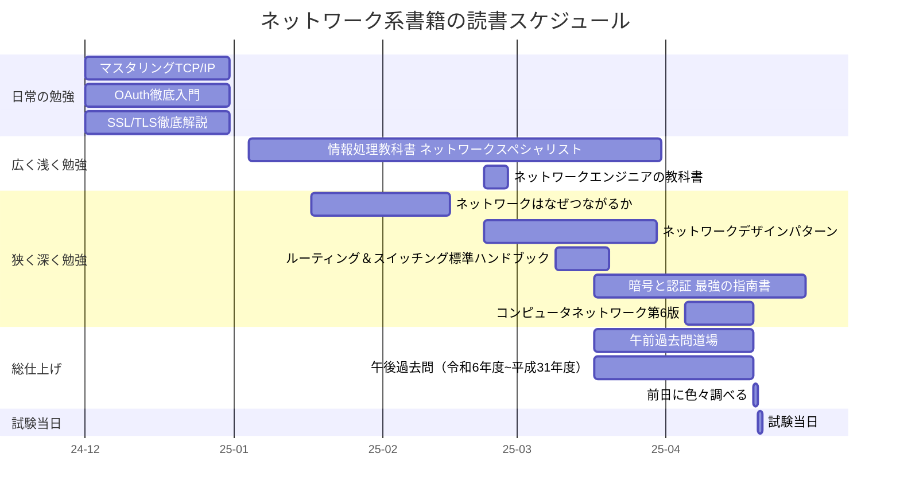

# 概要
2025/4/20に実施されたIPAのネットワークスペシャリスト試験（ネスペ）を受験したので、勉強法と感想についてまとめました。

筆者は（この4月から）新卒3年目で、ネットワークはほぼ未経験なので、そこも踏まえて色々書いていきます。

雑にまとめると、以下の通りです：
- ネスペ難しい
- かなり頑張った

~~※7月頃に合格発表のため、まだ合否は不明です。ただ、勉強の記録として記事を書きました（合格発表後に結果を記載予定…）~~
**2025/07/07追記**
合格しました。点数は以下の通りで、午後Iが本当にギリギリでした…
- 午前I ：免除
- 午前II：72点
- 午後I ：60点
- 午後II：78点

# 想定読者
- NW試験を受験予定の方
- 他の人の受験記録を参考にしたい方
- 特に新人や未経験での勉強法を知りたい方

# 前提
筆者の前提知識としては以下の通りです：

- 職業は、ソフトウェア開発（SIer）のデベロッパー
- クラウド（SaaSやPaaS）上での開発がメインで、ネットワークに関する開発経験はほぼない
- 新卒研修や普段の勉強を通じて、TCP/IPやHTTPのキホンのキは理解していた
- IPAの資格は、応用情報技術者試験（とデータベーススペシャリスト）を取得済み（※そのため午前免除）

また、キャリア志向としてはスペシャリスト寄りなので、以下のような方針で勉強しました：

- 勉強内容はできるだけ深く理解するように努めた
- 読んだ教科書も"徹底解説"のような（難しめの）本を選んだ

# 関連記事
ネットワークスペシャリスト試験とは直接関連が低いですが、データベーススペシャリストの合格体験記も書いています：
https://zenn.dev/neko_student/articles/595112769364f7

# 勉強法
ネスペの難易度は、範囲が広いうえ、深い知識も問われるイメージです。
そのため、初心者は膨大な量の知識を理解する必要があります。スケジュールには余裕をもって、広く深く学習していくことをおすすめします。

以下の流れで、勉強方法について説明していきます：
- 読んだ教科書
- 教科書や過去問を解き進めるスケジュール
- おおよその学習時間
- 過去問演習について説明

## 教科書
最初に、これまでに読んだネットワーク関連の本を列挙します。
上から順に（個人的に）おすすめなものを並べています。読む順番も上から順番で良いかなという感じです。

※おすすめ度と難易度を記載していますが、個人的感覚で以下のイメージです：
- おすすめ度
  - ★1~2つ：ネスペ対策という意味では読まなくても良いが、勉強にはなる。
  - ★3つ：必須ではないが、ネスペ対策には良い
  - ★4~5つ：是非読んだ方がよい
  - 注）あくまで私が読んだ本の中でですので、絶対この本が良いということではありません。もしかしたら類する本で良い本があるかもしれません。
- 難易度
  - ★1~2つ：ネスペを勉強するなら比較的簡単な本、もしくは広く浅くな本（と言っても、普通に難しい笑）
  - ★3つ：難しいが、よくまとまっているので比較的読みやすい
  - ★4~5つ：読み切るなら"そこそこ覚悟が必要"な程度に難しい。

| No | タイトル                                                               | 概要                                                   | 個人的所感                                                | おすすめ度 | 難易度   |
|----|--------------------------------------------------------------------|------------------------------------------------------|------------------------------------------------------|-------|-------|
| 1  | [マスタリングTCP/IP―入門編―(第6版)](https://amzn.asia/d/3euXBzY)              | ネットワークの基礎を学ぶための入門書。TCP/IPの基本的な概念やプロトコルについて詳しく解説している。 | TCP/IPは必修科目。                                         | ★★★★★ | ★★★☆☆ |
| 2  | [ネットワークはなぜつながるのか](https://amzn.asia/d/4S2EmYW)                     | タイトルの通りで、HTTP通信の一連の流れを具体的にわかりやすく解説してくれる。            | インターネット通信の全体像/イメージをつかむことができておすすめ。                    | ★★★★★ | ★★☆☆☆ |
| 3  | [ルーティング&スイッチング標準ハンドブック](https://amzn.asia/d/2RhVNZ7)               | ルーティングとスイッチングの基本から応用までを網羅したハンドブック。                   | ネスペに向けて、ルーティングアルゴリズムはほぼ必須科目                          | ★★★★★ | ★★★☆☆ |
| 4  | [情報処理教科書 ネットワークスペシャリスト 2025年版](https://amzn.asia/d/3nd2UG9)        | ネットワークスペシャリスト試験の対策書。範囲を網羅的に解説していて、午前午後の過去問が付録されている。  | ネスペ用の教科書は1冊あるとよい。解説は広く浅くな解説であるため、適宜他の参考書でカバーする必要がある。 | ★★★★☆ | ★★☆☆☆ |
| 5  | [SSL/TLS実践入門](https://amzn.asia/d/4xshdKi)                         | SSL/TLSの基本から実践的な使い方までを解説した書籍。セキュリティに関する知識が深まる。       | TLSを含め、公開鍵暗号や署名の知識はネスぺでよく出るのでおすすめ。                   | ★★★★☆ | ★★★★☆ |
| 6  | [インフラ/ネットワークエンジニアのためのネットワーク・デザインパターン](https://amzn.asia/d/9lUYW93) | ネットワークデザインの具体的な機器構成のパターンを学ぶための書籍。実践的な知識が得られる。        | 具体的な構成が学べて、実務未経験者にとってはかなりおすすめ。                       | ★★★★☆ | ★★★★★ |
| 7  | [日経ITエンジニアスクール 暗号と認証 最強の指南書](https://amzn.asia/d/2nzCf1n)          | 暗号と認証に関する知識を深めるための書籍。色々なトピックが載っている。                  | IPsecやVPNを学ぶために購入。雑誌のコラム集みたいな構成。                     | ★★★☆☆ | ★★★☆☆ |
| 8  | [コンピュータネットワーク第6版](https://amzn.asia/d/hbda0Ng)                     | 900ページ以上の大ボリュームで、ネットワークについて網羅的に書かれている。               | 広く深く書かれている本。全てを読み切るのは大変だが、足りない部分を補うにはおすすめ。           | ★★☆☆☆ | ★★★★★ |
| 9  | [改訂3版 ネットワークエンジニアの教科書](https://amzn.asia/d/fgYTf66)                | ネットワークエンジニアを目指す人におすすめの教科書。                           | 広く浅くな内容。ネスぺの教科書(No.4)よりは深めで補助的に読むのはあり。               | ★★☆☆☆ | ★★☆☆☆ |
| 10 | [OAuth徹底入門](https://amzn.asia/d/89NrOQO)                           | OAuthの基本から実践的な使い方までを網羅した書籍。セキュリティや認証に関する知識が深まる。      | 認証周りを勉強出来て良いが、ネスぺであまり出題されていないので優先度は低い。               | ★☆☆☆☆ | ★★★★☆ |

少しだけ、未経験者向けの補足です：

- No.1~No.3は特に、ネットワーク初心者にとっては必読だと思います。どちらかというと、ネスペを受けるうえでの前提知識くらいイメージです。
- No.6は、実践的な内容で、具体的なネットワーク構成が学べるので、実務未経験者には特におすすめです。

### その他教材
教科書以外の教材としては、以下を利用しました：
- [過去問道場](https://www.nw-siken.com/nwkakomon.php)：午前問題対策としてほぼ必須（1ヶ月だけメンバーシップ登録しました）
- ChatGPT：わからない部分を調べる。Google検索より圧倒的に早い（ChatGPTが不安な場合はGoogle検索で裏どりする）

## スケジュール
以下のようなスケジュールで勉強を進めていきました：

- 2025年1月以前は日頃の勉強として少しずつ学んでいた
- 本格的な勉強は2025年1月から開始した
  - 広く浅くな教科書で全体像をつかむ
  - その中で足りないと思った所を追加の教科書でしっかり学ぶ
- 最後の1ヶ月間は過去問を集中して取り組む
  - 午前IIは過去問道場を空き時間で実施した
  - 午後Iと午後IIを5年分実施した
- 試験日前日は、過去問を見返したりわからない単語をChatGPTに聞いたりした

## 勉強時間
勉強期間は、上記のスケジュールの通りで約3.5ヶ月（1月～4月中旬）でした。

正確な時間は測っていないですが、ざっくり100~120時間くらいだと思います：

- 1月～：空いた時間・気が向いたときに教科書を読み進める
  - 平日：0~30分/日ほど（仕事次第）
  - 休日：1~2時間/日ほど
- 2月中旬～：本格的に教科書を買い、読み進める（実力不足に気づき焦り始める）
  - 平日：30分/日ほど（仕事次第）
  - 休日：2~4時間/日ほど
- 3月中旬～：ラストスパートで、空いた時間はほぼネスペの勉強に使う
  - 平日：30分～1時間/日ほど（仕事次第）
  - 休日：4~6時間/日ほど

## 過去問の解き方について
### 午前問題
過去問道場などを活用して、不安がなくなるまで解くとよいと思います。

個人的に、実際に受験してみて、暗記が足りなかったなと感じました。特にイーサネットや各種プロトコルのヘッダーなど、午後問題には出にくいが、暗記が必要な問題も出題されやすいと思います。午前と甘く見ずに、しっかり対策するとよいと思います。

### 午後問題
午後の過去問は、できるだけ多くの年度を解くとよいと思います。筆者は5年分の過去問を実施しました。過去問を通して、出題形式に慣れることや、自分の足りない部分が把握することが一番の目的だと思います。

問題を解くペースは人それぞれですが、比較的時間に余裕がある試験だと思います。そのため、試験時間にこだわらずに、素早く解いていくことが個人的におすすめです（時間をかけるより、とりあえず先に進めていく方法が、個人的には好き）

理想は、「一回の過去問演習＋模範解答を見る」ことで完全に理解しきることですが、それだけでは難しいので、何度か解き直す必要があると思います。筆者の場合は、一回解き、試験直前に問題を見返しました（解き直すというより、問題と解答を見ながら、わからない部分はないかを確認していきました）。

# 試験の感想
当日は落ち着いて、しっかり問題を解くとよいと思います！
全体的に感じたことは以下の通りです：
- 早めに1周問題を解き切り、残り時間をしっかり見直しの時間に使うとよい。
  - 解くペース次第ですが、個人的には試験時間に余裕があると感じています。
  - わからない問題があっても焦らず、一旦後回しにするのもあり。
- 午後は設問を選択する必要があるが、そこも落ち着いて選択するとよい。
  - 時間には余裕があるので、最初の5分くらい、一通り問題を眺めてみる。
  - もしわからない単語ばかりでも、問題文に誘導があったりするので、望みを捨てない。

## 午前II
想像より難しかったです（個人的には、過去問よりかなり難しかった…）

特に暗記不足だったな…と感じています。
午後問題を重視して対策していたのですが、午前もしっかり対策しておくことをおすすめします。

## 午後I
こちらは過去問の難易度とあまり変わらない印象でした。
時間は、1時間ほどで問題を解き切り、残り30分は見直しの時間に使えました。

## 午後II
IPv6とIoTに関する出題で、個人的にあまり勉強していなかった範囲なので焦りました。
ただ、（IPv6を設問を選択したのですが）問題文の中でIPv6についての説明もあり、落ち着けばしっかり解くことができました（※手ごたえベースの感想）

時間は、1時間15分ほどで解き切り、残り45分は見直しの時間に使えました。

# まとめ
ネスペ受験者の一例として参考になれば幸いです。

総じて、範囲が広いうえ難しい試験だと思います。スケジュールには余裕をもって、しっかり対策していきましょう！