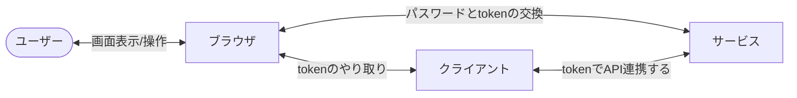
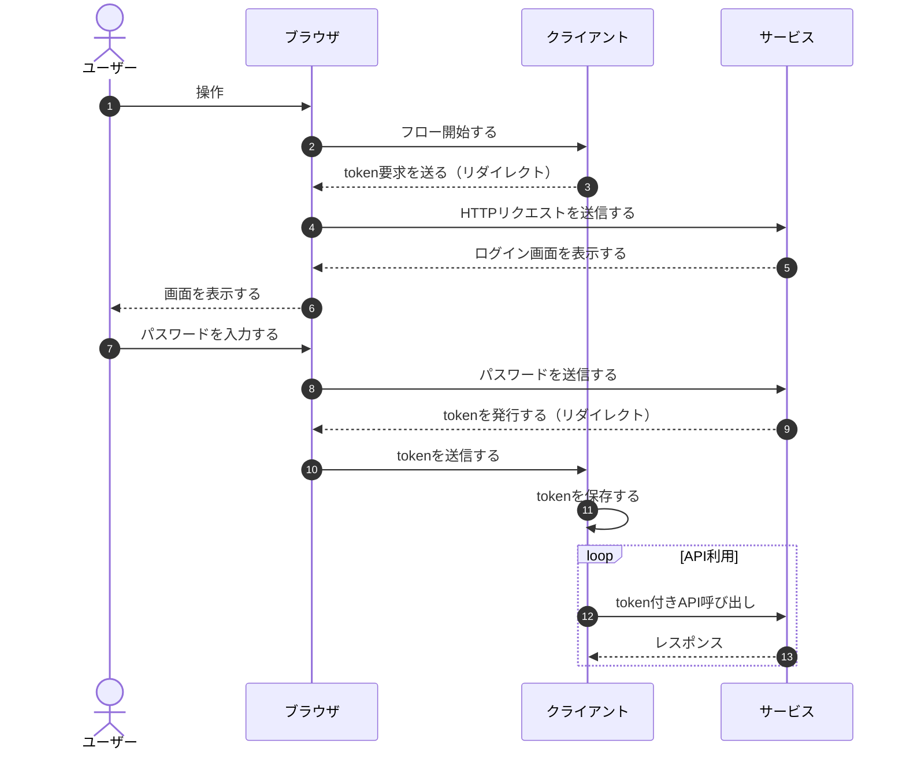
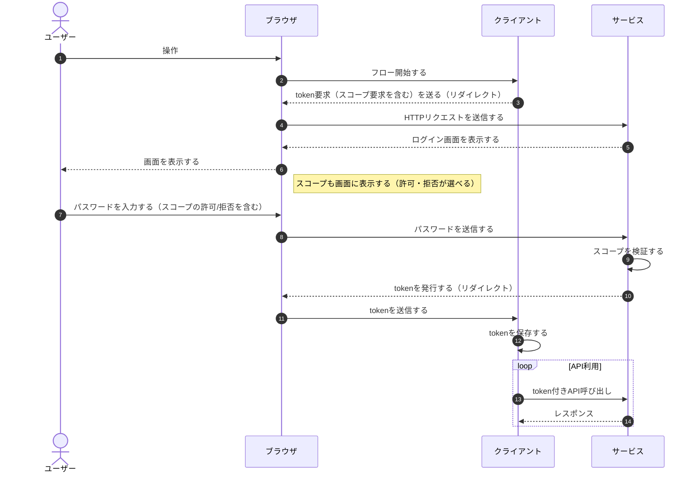
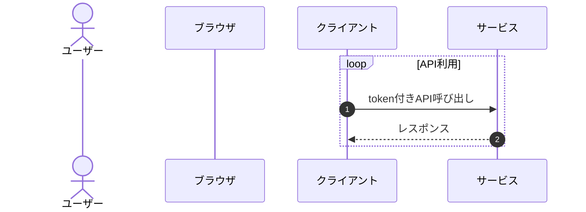
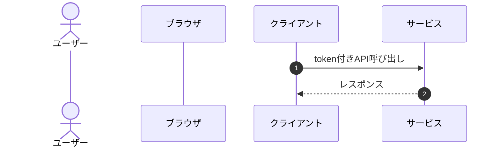
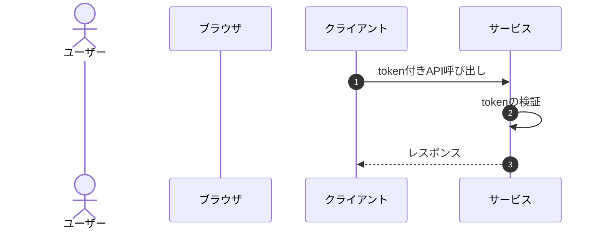
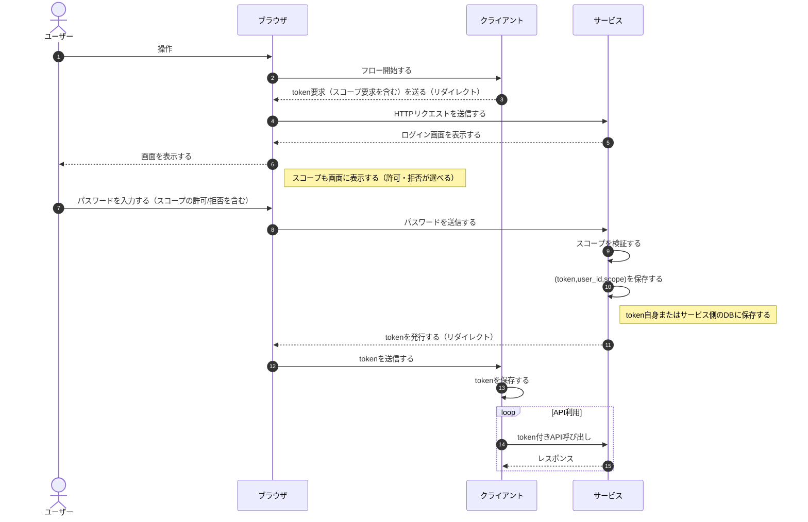
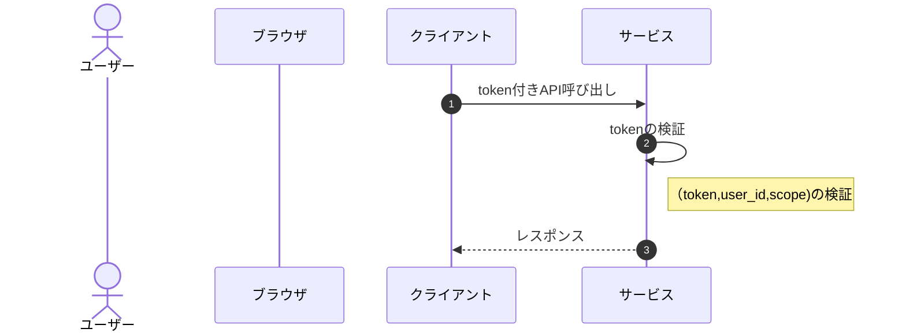

# Day3

Day1, Day2を経て、基本形となる処理の流れが設計できてきました。今回は、セキュリティ観点を中心に検討していきたいと思います。

## Day2までの図（再掲）

※シーケンス図の番号だけ修正しています

## セキュリティを考える

Day2までの設計を基に、セキュリティ観点の問題を考えていきます。

Day3では、すぐに思いつくzeroauthの問題点を挙げて、設計改善していきます（Day4以降で、より網羅性を担保しながら設計していきます）。

Day3で扱う問題点は以下の3つです：

1. tokenの権限の範囲が規定されていない（実質全権限の状態）
2. tokenの失効方法が規定されていない（無期限で使えてしまう）
3. tokenがずっと使い回されている（一度でも漏洩すると問題）
4. tokenはクライアント以外でも使える（漏洩すると簡単に悪用できる）

## 1. tokenの権限の範囲が規定されていない

最初は、tokenの権限について考えていきます。実は、zeroauthの目的の以下の部分は、まだ解決できていませんでした。

> - パスワードを渡すことは、実質全ての権限を渡すことに等しいため

Day2までで「パスワードを渡すこと」の部分は解決したものの、「全ての権限を渡す」の部分は未検討でした。

解決策としては、「tokenを発行するタイミングで、権限の範囲（スコープ）を決めておく」ことです。

※以降では、（OAuthに合わせて）権限の範囲を**スコープ**と呼ぶことにします。

スコープの設計において、以下の点は検討が必要です。

- スコープを誰が決めるか
- token利用時のスコープの検証

次節で検討していきます。

### スコープを誰が決めるか

一つ目は、「スコープを誰が決めるのか」です。zeroauthの登場人物は、ユーザー、クライアント、サービスの3人なので、それぞれ考えてみます。

- ユーザー：権限を持つ主体であり、権限（スコープ）を許可する
- クライアント：tokenを要求する側であり、特定のスコープを要求する
- サービス：tokenを発行する側であるが、ユーザーとクライアントの要求を検証する

基本的には、クライアントがtoken要求をしているので、スコープを決めるのもクライアントになります。ただし、悪意のあるクライアントが（不必要に）広いスコープを要求する可能性があり、それは防ぐ必要があります。

そのために、ユーザーが明示的に許可することが必要です。また、サービス側が、スコープの妥当性を検証することも考えられます。

※Day3時点では、「サービスによるスコープの検証」の詳細は、検討しないことにします。想定としては、クライアント毎に要求可能なスコープを決めておく、ユーザーの権限を越えていないこと、などが挙げられます。

### token利用時のスコープの検証

スコープはtoken発行する時だけ意識すればよいわけではありません。

API連携の時に正しく検証する必要があります。これまで詳細を規定していませんでしたが、API連携部分を検討していきます。

まず、シーケンス図を書き換えていきます。

---

初めに、これまでのシーケンス図のAPI連携部分だけを抜き出します。

---

次に、一回のAPI連携に注目するので、`loop`は外しています。

---

最後に、tokenの検証を加えます。

上記を基にスコープの検証について検討しておきます。

まず、必要な情報は、以下の3つです。

- token: token自身
- user_id: どのユーザーが発行したか
- scope: 権限の範囲（スコープ）

検証のためには、以下の2パターンの方法があります：

1. token自体に書き込む方法
2. サービスのデータベースで管理する方法

なお、1の場合は、署名など（JWT方式など）、書き換えできない工夫が必要です。

Day3では、これ以上の詳細に立ち入らないこととし、(token,user_id,scopr)を記録すること、それをtoken利用時に検証することの2つだけを規定しておきます。

token発行時、token利用時のシーケンス図は以下の通りです。

---

## まとめ

以上により、tokenの権限（スコープ）の定義ができました。これで、「全ての権限を渡す」必要がなくなり、当初の目的の一つが解消されました。

なお、冒頭で提示した問題は、以下の3つが残っています：

2. tokenの失効方法が規定されていない（無期限で使えてしまう）
3. tokenがずっと使い回されている（一度でも漏洩すると問題）
4. tokenはクライアント以外でも使える（漏洩すると簡単に悪用できる）

ただし、Day3が長くなったので、今日はここまでとし、Day4以降で検討していきます。