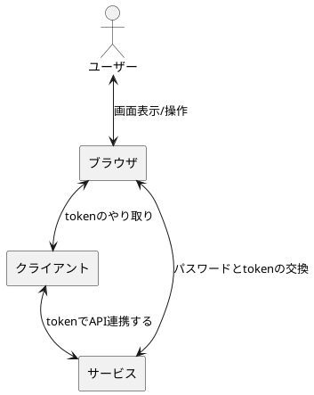
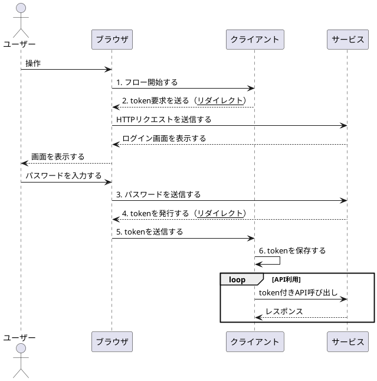
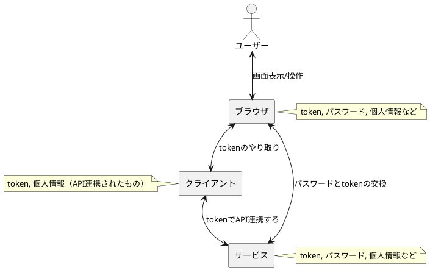
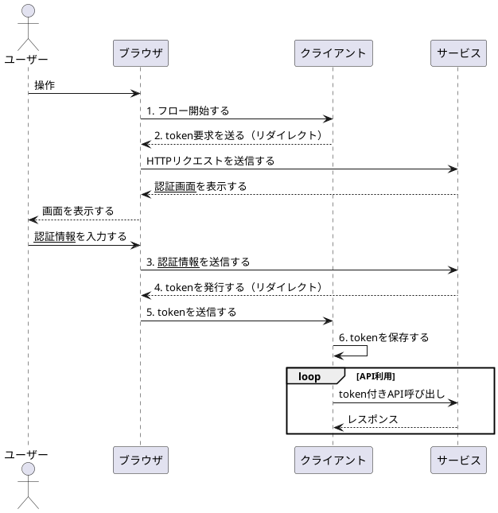

# Day3

Day1, Day2を経て、基本形となる処理の流れが設計できてきました。今回は、セキュリティ観点で、問題を洗い出していきたいと思います。

## Day2までの図（再掲）

## セキュリティを考える

Day2までの設計を基に、セキュリティ観点の問題を考えていきます。

進め方としては、以下の順番に考えていきます：

- （攻撃者に）奪われたら困るものを洗い出す
- 「それらはどうすれば奪えるのか」を考える・・・①
- 「それらが奪われたらどうなるか」を考える・・・②
- ①を基に、奪われない方法を考える
- ②を基に、奪われた後に被害を減らす方法を考える

### 奪われたら困るもの

まず、zeroauthで登場するものは以下の通りです。

- サービスのパスワード
- token
- （サービス内に保存されているユーザーの）個人情報など

token,パスワード,個人情報はどれも奪われると困ります。ただし、パスワードはスコープ外とします。詳細は次節の通りで、話を簡潔にするためです。

### サービスでの認証はスコープ外とする

Day2までの設計では、クライアントのtoken要求に対して、

- サービスはログイン画面を表示して、
- ユーザーはパスワードを使ってログインをする

と定義していました。しかし、実際にはログイン方法は何でもよく、パスワードといっても、ワンタイムパスワードでもいいですし、パスワード以外にも、パスキー、指紋認証などもあります。

zeroauthとしては、「サービスがユーザーを認証する」ことだけが必要で、その方法は何でもよいです。こうすることで、zeroauthとして、「パスワードをどう守るか？」を考える必要はなくなります（実際に使用する認証方法の脆弱性は考える必要はあるが、zeroauth側のフレームワークとしては考える必要がない）。

改めてシーケンス図を修正すると、以下の通りです。

## tokenと個人情報を守るには？

前節の議論により、考慮が必要なのはtokenと個人情報に絞られました。

次に、①「それらはどうすれば奪えるのか」と②「それらが奪われたらどうなるか」を考えていきます。