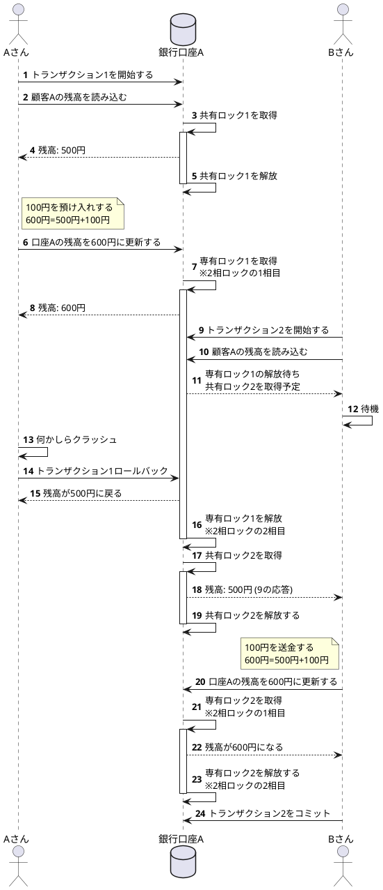

想定ケース
- Aさんの現在の口座残高が500円
- Aさんは100円を預け入れしたい
- Bさんは100円を送金したい

```plantuml
@startuml
actor Aさん as T1
database 銀行口座A as DB
actor Bさん as T2

autonumber

T1 -> DB: トランザクション1を開始する
T1 -> DB: 顧客Aの残高を読み込む
DB -> DB++: 共有ロック1を取得
DB --> T1: 残高: 500円
DB -> DB--: 共有ロック1を解放
note right of T1
  100円を預け入れする
  600円=500円+100円
end note
T1 -> DB: 口座Aの残高を600円に更新する
DB -> DB++: 専有ロック1を取得\n※2相ロックの1相目
DB --> T1:  残高: 600円
T2 -> DB: トランザクション2を開始する
T2 -> DB: 顧客Aの残高を読み込む
DB --> T2: 専有ロック1の解放待ち\n共有ロック2を取得予定
T2 -> T2: 待機
T1 -> T1: 何かしらクラッシュ
T1 -> DB: トランザクション1ロールバック
DB --> T1: 残高が500円に戻る
DB -> DB--: 専有ロック1を解放\n※2相ロックの2相目
DB -> DB++: 共有ロック2を取得
DB --> T2: 残高: 500円 (9の応答)
DB -> DB--: 共有ロック2を解放する
note left of T2
  100円を送金する
  600円=500円+100円
end note
T2 -> DB: 口座Aの残高を600円に更新する
DB -> DB++: 専有ロック2を取得\n※2相ロックの1相目
DB --> T2: 残高が600円になる
DB -> DB--: 専有ロック2を解放する\n※2相ロックの2相目
T2 -> DB: トランザクション2をコミット

@enduml
```

今回は整合性が取れている。