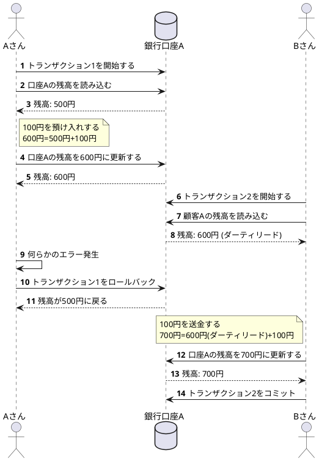

想定ケース
- Aさんの現在の口座残高が500円
- Aさんは100円を預け入れしたい
- Bさんは100円を送金したい

```plantuml
@startuml
actor Aさん as T1
database 銀行口座A as DB
actor Bさん as T2


autonumber

T1 -> DB: トランザクション1を開始する
T1 -> DB: 口座Aの残高を読み込む
DB --> T1: 残高: 500円
note right of T1
  100円を預け入れする
  600円=500円+100円
end note
T1 -> DB: 口座Aの残高を600円に更新する
DB --> T1: 残高: 600円
T2 -> DB: トランザクション2を開始する
T2 -> DB: 顧客Aの残高を読み込む
DB --> T2: 残高: 600円 (ダーティリード)
T1 -> T1: 何らかのエラー発生
T1 -> DB: トランザクション1をロールバック
DB --> T1: 残高が500円に戻る
note left of T2
  100円を送金する
  700円=600円(ダーティリード)+100円
end note
T2 -> DB: 口座Aの残高を700円に更新する
DB --> T2: 残高: 700円
T2 -> DB: トランザクション2をコミット
@enduml
```
結果、残高が増えてHappy(?)