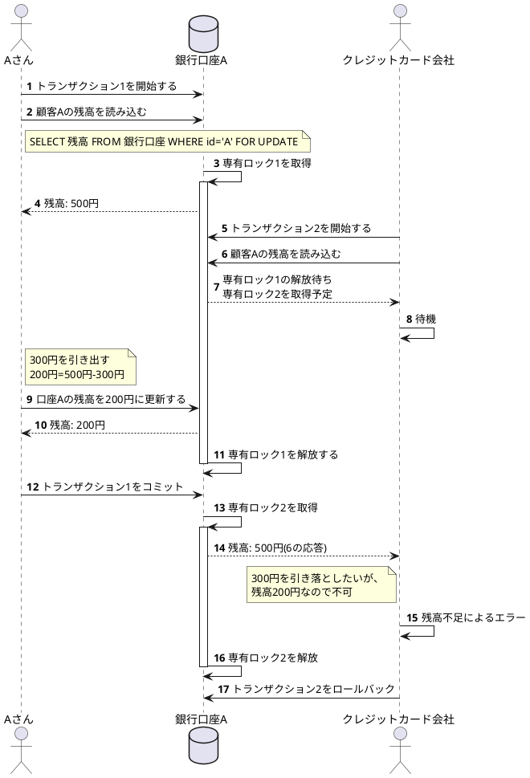

想定ケース
- Aさんの現在の口座残高が500円
- Aさんは300円を引き出したい
- クレジットカードは300円を引き落としたい
- まずは、READ COMMITEDでノンリピータブルリードが発生する場合

```plantuml
@startuml
actor Aさん as T1
database 銀行口座A as DB
actor クレジットカード会社 as T2

autonumber

T1 -> DB: トランザクション1を開始する
T1 -> DB: 顧客Aの残高を読み込む
note right of T1
  SELECT 残高 FROM 銀行口座 WHERE id='A' FOR UPDATE
end note
DB -> DB++: 専有ロック1を取得
DB --> T1: 残高: 500円
T2 -> DB: トランザクション2を開始する
T2 -> DB: 顧客Aの残高を読み込む
DB --> T2: 専有ロック1の解放待ち\n専有ロック2を取得予定
T2 -> T2: 待機
note right of T1
  300円を引き出す
  200円=500円-300円
end note
T1 -> DB: 口座Aの残高を200円に更新する
DB --> T1: 残高: 200円
DB -> DB--: 専有ロック1を解放する
T1 -> DB: トランザクション1をコミット
DB -> DB++: 専有ロック2を取得
DB --> T2: 残高: 500円(6の応答)
note left of T2
  300円を引き落としたいが、
  残高200円なので不可
end note
T2 -> T2: 残高不足によるエラー
DB -> DB--: 専有ロック2を解放
T2 -> DB: トランザクション2をロールバック

@enduml
```

クレジットカードの支払いができませんでしたが、整合性は取れました。