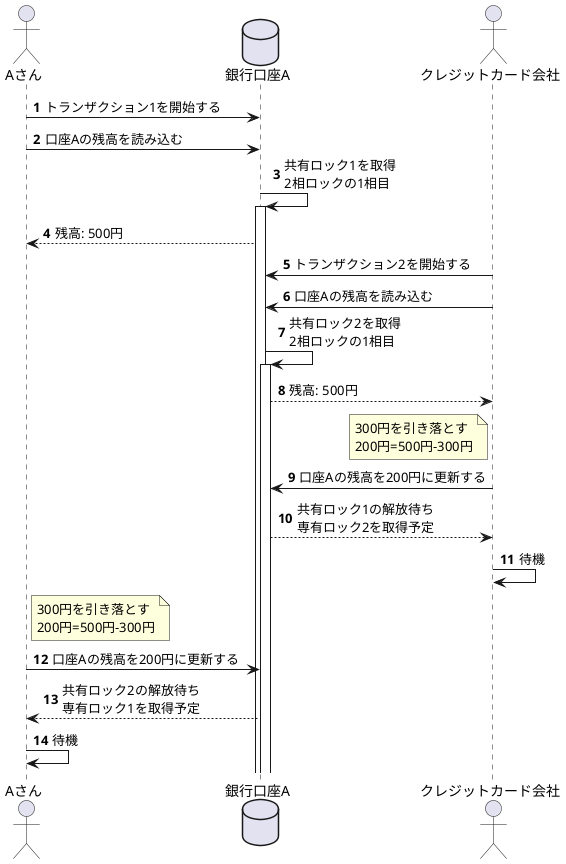

想定ケース
- Aさんの現在の口座残高が500円
- Aさんは300円を引き出したい
- クレジットカードは300円を引き落としたい

結果、デッドロックが発生しました(あまり良い例ではなかったかもしれないが、ノンリピータブルリードは防げた)
この後は、いずれかのトランザクションがロールバックして、整合性が取れた状態になる。なお、ロールバックするトランザクションはデッドロック解除の方式に依る。